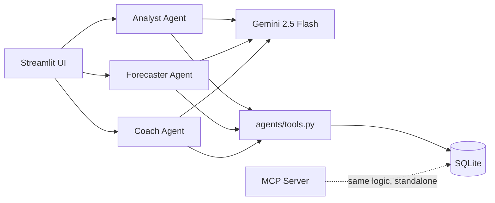

# 💸 FinBuddy — Your AI Financial Companion

Built for the **Google × Kaggle AI Agents Intensive: Vibe Coding Capstone**.

FinBuddy is an AI financial companion powered by three specialized Google
ADK agents that analyze your spending, forecast what's coming next, and
coach you toward your savings goals — each in a personality you choose.

---

## Table of Contents

- [Overview](#overview)
- [Problem Statement](#problem-statement)
- [Solution](#solution)
- [Concepts Demonstrated](#concepts-demonstrated)
- [AI Agent Architecture](#ai-agent-architecture)
- [Technology Stack](#technology-stack)
- [Folder Structure](#folder-structure)
- [Installation](#installation)
- [Setup](#setup)
- [Usage Guide](#usage-guide)
- [Screenshots](#screenshots)
- [Security](#security)
- [Future Scope](#future-scope)

---

## Overview

Most budgeting apps are passive — they log what already happened and stop
there. FinBuddy uses AI agents to actively **reason** about your money:
what's happening now, what's likely to happen next month, and whether
you're on track for your goals — delivered in a voice that actually feels
like talking to a friend, not reading a bank statement.

## Problem Statement

Digital payments make spending frictionless, which makes overspending
invisible until it's already a problem. Traditional budgeting tools log
transactions and render charts, but they don't predict, don't connect
today's purchase to tomorrow's goal, and communicate in a flat, forgettable
voice. People don't need another expense tracker — they need something
that reasons about their money the way a smart, honest friend would.

**Who benefits:** anyone who wants financial feedback that's specific and
grounded in their actual numbers, not generic advice — and who responds
better to a real tone (sarcastic, strict, supportive, motivational) than a
neutral notification.

## Solution

Three specialized AI agents, each backed by Google ADK and Gemini 2.5
Flash, share one financial dataset and one personality system:

| Agent | Job |
|---|---|
| **Analyst** | Summarizes recent spending patterns and trends in plain language |
| **Forecaster** | Estimates next month's likely total spend, with reasoning |
| **Coach** | Checks budget status and savings goals, delivers a personality-flavored check-in |

All backed by a real MCP server exposing the financial data, and a
Streamlit dashboard with a personality picker (sarcastic / supportive /
strict / coach) that changes every agent's tone on the same underlying data.

Full write-up: [`docs/KAGGLE_WRITEUP.md`](docs/KAGGLE_WRITEUP.md)

## Concepts Demonstrated

This project explicitly demonstrates the following course concepts:

| Concept | Where it's demonstrated |
|---|---|
| **Agent / Multi-Agent System (ADK)** | Three independent, specialized `google.adk.agents.Agent` instances (`agents/analyst_agent.py`, `forecaster_agent.py`, `coach_agent.py`), each with its own model, instruction, and tools — see [AI Agent Architecture](#ai-agent-architecture) |
| **MCP Server** | `mcp_server/server.py` — a real, standalone, independently runnable MCP server (built with the official `mcp` SDK / FastMCP) exposing 5 tools over the actual MCP protocol |
| **Security Features** | Input validation & category allow-listing at the data boundary, parameterized SQL throughout, `.env`-based key handling excluded from git, graceful error handling with no stack-trace leakage — full detail in [`docs/SECURITY.md`](docs/SECURITY.md) |
| **Agent Skills** | Each agent's tool functions (`agents/tools.py`) are ADK-discoverable skills, with docstrings and type hints that ADK uses to auto-generate tool schemas (verified via `FunctionTool._get_declaration()`) |
| **Deployability** | Optional — see [Setup](#setup). A well-documented public GitHub repo is used as the primary deliverable per project scope |

*(Antigravity was evaluated and intentionally not used — it didn't add
value at this project's scope, per the brief's own guidance not to force it.)*

## AI Agent Architecture

See [`docs/ARCHITECTURE.md`](docs/ARCHITECTURE.md) for the full diagram and
explanation. Summary:



Every agent follows the same shape — name, model, instruction, tools —
which is why a 4th or 5th agent could be added by copying the existing
pattern rather than inventing new plumbing.

## Technology Stack

| Layer | Choice | Why |
|---|---|---|
| Agent framework | Google ADK | Required by capstone brief; lightweight agent model |
| LLM | Gemini 2.5 Flash | Free tier, no billing required (confirmed as of mid-2026) |
| Tool protocol | MCP (`mcp` SDK / FastMCP) | Real, standalone tool server |
| Database | SQLite | Zero-setup, file-based, sufficient for MVP scope |
| UI | Streamlit | Fastest path to a working, demoable interface |
| Config | `python-dotenv` | Standard `.env`-based secret handling |

**100% free tier, no credit card required anywhere in this stack.**

## Folder Structure

```
finbuddy/
├── agents/
│   ├── analyst_agent.py      # Spending analysis agent
│   ├── forecaster_agent.py   # Next-month prediction agent
│   ├── coach_agent.py        # Budget/goals coaching agent + personality
│   ├── tools.py              # Shared tool functions (wraps mcp_server logic)
│   └── runner_utils.py       # Shared agent-execution + retry helper
├── mcp_server/
│   └── server.py             # Standalone MCP server (5 tools)
├── data/
│   ├── schema.sql            # SQLite schema
│   ├── generate_data.py      # Synthetic transaction generator
│   └── finbuddy.db           # Generated database (included, pre-built)
├── ui/
│   └── app.py                # Streamlit dashboard
├── docs/
│   ├── ARCHITECTURE.md
│   ├── SECURITY.md
│   ├── KAGGLE_WRITEUP.md
│   ├── DEMO_VIDEO_SCRIPT.md
│   ├── MEDIA_GALLERY_CHECKLIST.md
│   ├── FUTURE_SCOPE.md
│   └── DAY1_NOTES.md / DAY2_NOTES.md / DAY3_NOTES.md  (build log)
├── requirements.txt
├── .gitignore
└── README.md
```

## Installation

```bash
git clone <your-repo-url>
cd finbuddy
pip install -r requirements.txt
```

If you hit an "externally-managed-environment" error on newer Python:
```bash
pip install -r requirements.txt --break-system-packages
```

## Setup

1. **Get a free Gemini API key** (no card required):
   [https://aistudio.google.com/apikey](https://aistudio.google.com/apikey)
   → sign in → "Create API key."

2. **Create a `.env` file** in the project root (same folder as this
   README):
   ```
   GEMINI_API_KEY=your_key_here
   ```

3. **(Optional) Regenerate the synthetic data** — a pre-built database is
   already included, so this is only needed if you want fresh random data:
   ```bash
   cd data
   python generate_data.py
   ```

## Usage Guide

**Run the dashboard:**
```bash
cd ui
streamlit run app.py
```
Opens automatically at `http://localhost:8501`.

1. Pick a personality in the sidebar (sarcastic, supportive, strict, coach).
2. Click "Generate Analysis" for a spending summary.
3. Click "Generate Forecast" for a next-month estimate.
4. Click "Get Check-in" for a budget/goals coaching message.

**Run an agent directly (for testing/demo):**
```bash
cd agents
python analyst_agent.py
```

**Run the MCP server standalone** (demonstrates it as a real MCP artifact):
```bash
cd mcp_server
python server.py
```

> ⚠️ Gemini's free tier has a daily/per-minute request quota. If you see a
> `429` error, wait a bit — this isn't a bug or a billing issue. See
> `agents/runner_utils.py` for the retry logic already handling transient
> failures automatically.

## Screenshots

*(See [`docs/MEDIA_GALLERY_CHECKLIST.md`](docs/MEDIA_GALLERY_CHECKLIST.md)
for exactly what to capture. Add images to `docs/screenshots/` and update
the paths below.)*


## Security

API keys via `.env` (git-excluded), input validation and allow-listing at
the data boundary, parameterized SQL throughout, no stack traces surfaced
to end users. Full detail: [`docs/SECURITY.md`](docs/SECURITY.md).

## Future Scope

Including the originally-planned "Should I Buy This?" Decision
Orchestrator (built and verified, removed to manage free-tier quota — see
details in the doc below), a statistical forecasting model, multi-user
auth, and optional deployment. Full list:
[`docs/FUTURE_SCOPE.md`](docs/FUTURE_SCOPE.md)

---

Built as part of the Google × Kaggle AI Agents Intensive: Vibe Coding
Capstone. 100% free-tier tools, zero paid infrastructure.
