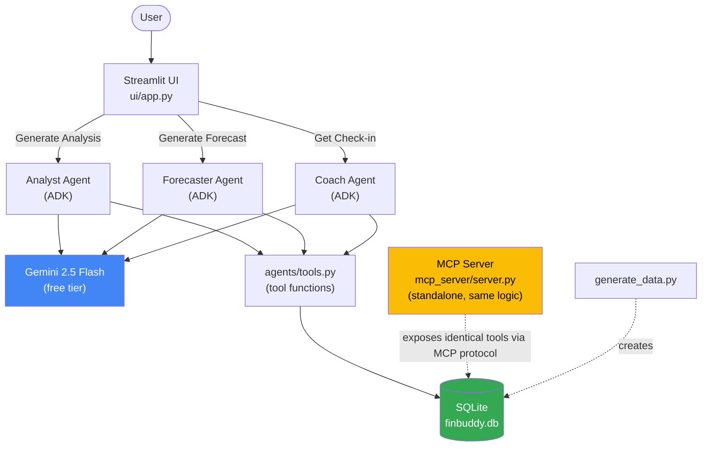

# FinBuddy — Architecture

## Diagram

## Why it's shaped this way

**Single source of truth for data access.** Every number any agent ever sees
comes from `mcp_server/server.py`'s functions — `get_transactions`,
`get_budget_status`, `get_savings_goals`, `get_spending_summary`,
`get_user_profile`. Nothing else in the codebase writes raw SQL. This is
what makes the system auditable: if a number looks wrong, there's exactly
one place to check.

**The MCP server is a real, standalone artifact.** It's fully runnable on
its own (`python mcp_server/server.py`) and speaks the actual MCP protocol
over stdio — it isn't a stub. The three ADK agents import the same
underlying Python functions directly (via `agents/tools.py`) rather than
opening a live MCP client connection at runtime. That's a deliberate
simplicity trade-off: it avoids subprocess/connection-lifecycle complexity
with zero loss of correctness, since both paths execute identical logic.

**Three independent, specialized agents — not one do-everything agent.**
Each agent (Analyst, Forecaster, Coach) has a narrow, clearly-scoped job and
its own system prompt. This is what "Agent/Multi-Agent System" means in
practice here: multiple purpose-built ADK agents cooperating within one
application, each callable independently from the UI.

**Personality is data, not code.** The user's chosen tone (sarcastic,
supportive, strict, coach) is a single field in the `users` table. Every
agent reads it via `get_user_profile` and adjusts its own voice accordingly
— adding a 5th personality later means editing a prompt, not writing new
logic.

## Data flow for a single "Generate Analysis" click

1. User clicks the button in the Streamlit UI.
2. UI calls `run_agent(analyst_agent, "Give me a summary...")`.
3. ADK's runtime sends the prompt + tool declarations to Gemini 2.5 Flash.
4. Gemini decides to call `get_user_profile`, then `get_monthly_spending_trend`,
   then `get_recent_transactions` — each call executes real Python against
   the SQLite database and returns real numbers.
5. Gemini reasons over the returned data and produces a final text answer.
6. The UI displays that text in the Spending Analysis tab.

No step in this chain uses placeholder or hallucinated data — every number
the model reasons over came from an actual database query.
